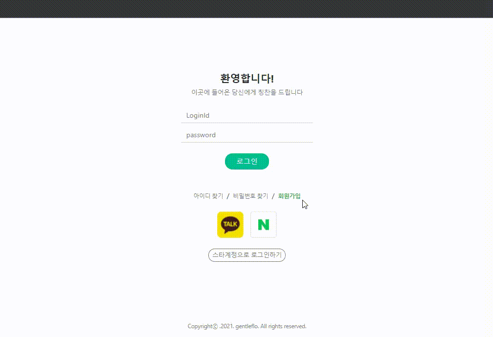
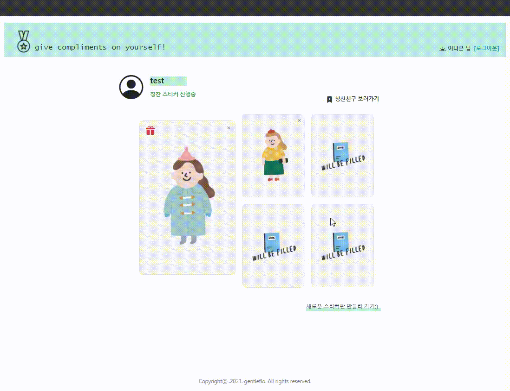
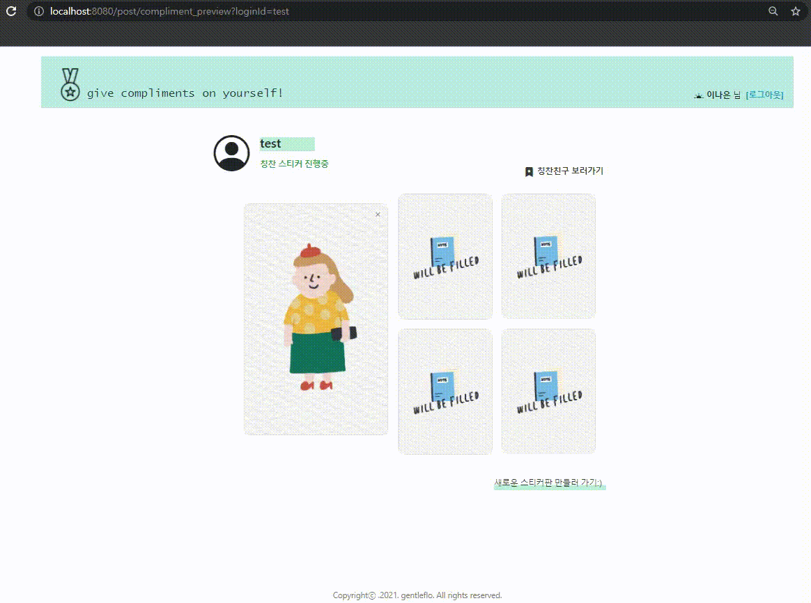
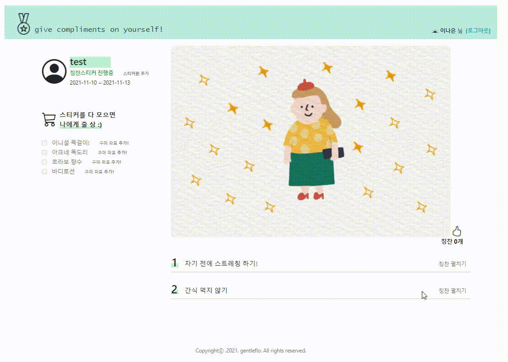
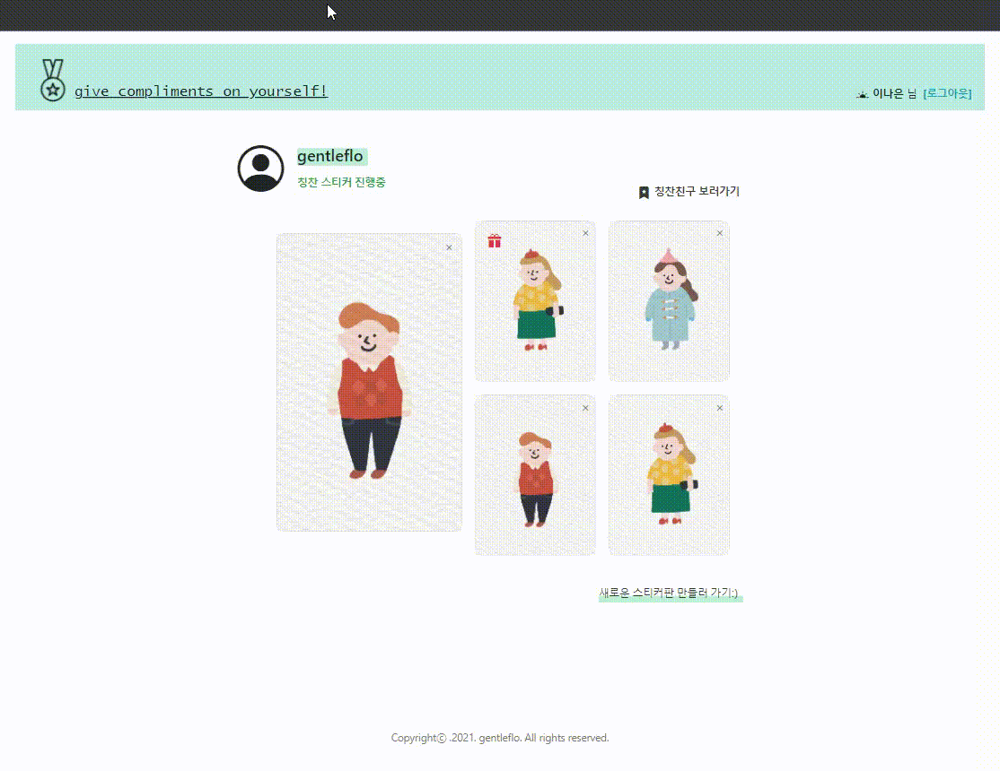

</a> 
</a>
</a>
</a> 
</a> 
</a> 
</a>
</a> 
</a>        

# ✨ complimentSticker_project ✨  

### <칭찬 스티커 프로젝트>

 
  ### :speech_balloon: 프로젝트 설명
  > 기획, DB와 URL 설계 그리고 구현까지 모든 단계를 직접한 1인 프로젝트.        
  프로젝트의 내용은 어른들을 위한 칭찬스티커 서비스 구현으로 SNS 서비스와 비슷한 결을 가지고 있다.      
  회원가입을 한 사용자들을 기반으로 운용되며 칭찬스티커판 입력 화면, 칭찬스티커 미리보기 화면, 칭찬스티커 디테일 화면으로 구성되어 있다.
  주요 기능은 **플랜입력, 칭찬스티커 클릭 이벤트, 위시리스트 구매좌표 추가, 선물하기 그리고 선물알람 기능**이다.               

  ### :two_hearts: 프로젝트 url
  > [칭찬스티커홈페이지](http://3.35.141.139:8080/user/signin_view)     
  > loginID : test      
  > password : 0000

  ### :notebook: 포트폴리오
  > [포트폴리오](portfoglio/칭찬스티커-프로젝트.pdf)

  ### :bar_chart: 설계 
  > <b>UI 기획</b>        
         https://ovenapp.io/project/HhL5zZxmgEV0Yuh9hYVZol2dCxhPvq2K#znrym           
    <b>Database, URL 설계</b>        
         https://docs.google.com/spreadsheets/d/1zrfdTG78FCGmXo07CDoIdPz0obrp3dQlT-Px5g2f3Tw/edit#gid=1871324353
  

 
  ### :movie_camera: 주요 기능 시연 데모    
  :one: 회원가입 / 로그인
    
  
  :two: 칭찬스티커 플랜 입력
     
  
  :three: 칭찬스티커 포스트 미리보기 타임라인 - 타사용자 페이지 방문 / 선물알람 확인 / 칭찬플랜 포스트 삭제
        
  
  :four: 포스트 디테일 화면 - 칭찬스티커판 스티커 클릭 후 등록
        
  
  :five: 포스트 디테일 화면 - 좋아요 / 댓글 등록
       
  
  :six: 포스트 디테일 화면 - 구매좌표추가 / 나에게 선물하기
       
  
  :seven: 친구에게 선물하기 
    
  
  
  
  ### :pushpin: 주요기능 
  > * __회원가입 / 로그인__          
    - package : [com.gentleflo.complimentSticker.user.*](https://github.com/gentleflo/compliment_project/tree/develops/src/main/java/com/gentleflo/complimentSticker/user)     
    - view : [/webapp/WEB-INF/jsp/user/*](https://github.com/gentleflo/compliment_project/tree/develops/src/main/webapp/WEB-INF/jsp/user)                       
  > * __칭찬스티커 플랜 포스트 입력__            
    - package : [com.gentleflo.complimentSticker.post.*](https://github.com/gentleflo/compliment_project/tree/develops/src/main/java/com/gentleflo/complimentSticker/post)       
    - view : [/webapp/WEB-INF/jsp/post/complimentEdit.jsp](https://github.com/gentleflo/compliment_project/blob/develops/src/main/webapp/WEB-INF/jsp/post/complimentEdit.jsp)      
  > * __타 사용사 페이지 방문__           
    - package : [com.gentleflo.complimentSticker.post.*](https://github.com/gentleflo/compliment_project/tree/develops/src/main/java/com/gentleflo/complimentSticker/post)    
    - view : [webapp/WEB-INF/jsp/post/complimentPreview.jsp](https://github.com/gentleflo/compliment_project/blob/develops/src/main/webapp/WEB-INF/jsp/post/complimentPreview.jsp)         
  > * __선물알람 확인__      
    - package : [com.gentleflo.complimentSticker.post.*](https://github.com/gentleflo/compliment_project/tree/develops/src/main/java/com/gentleflo/complimentSticker/post)       
    - view : [webapp/WEB-INF/jsp/post/complimentPreview.jsp](https://github.com/gentleflo/compliment_project/blob/develops/src/main/webapp/WEB-INF/jsp/post/complimentPreview.jsp)     
  > * __칭찬플랜 삭제__       
    - package : [com.gentleflo.complimentSticker.post.*](https://github.com/gentleflo/compliment_project/tree/develops/src/main/java/com/gentleflo/complimentSticker/post)       
    - view : [webapp/WEB-INF/jsp/post/complimentPreview.jsp](https://github.com/gentleflo/compliment_project/blob/develops/src/main/webapp/WEB-INF/jsp/post/complimentPreview.jsp)   
  > * __칭찬스티커판 스티커 클릭 이벤트__     
    - package : [com.gentleflo.complimentSticker.post.stickerNumber.*](https://github.com/gentleflo/compliment_project/tree/develops/src/main/java/com/gentleflo/complimentSticker/post/stickerNumber)      
    - view : [webapp/WEB-INF/jsp/post/complimentDetailView.jsp](https://github.com/gentleflo/compliment_project/blob/develops/src/main/webapp/WEB-INF/jsp/post/complimentDetailView.jsp)       
  > * __구매좌표추가, 나에게 선물하기__    
    - package : [com.gentleflo.complimentSticker.post.wishList.*](https://github.com/gentleflo/compliment_project/tree/develops/src/main/java/com/gentleflo/complimentSticker/post/wishList)     
    - package : [com.gentleflo.complimentSticker.post.gift.*](https://github.com/gentleflo/compliment_project/tree/develops/src/main/java/com/gentleflo/complimentSticker/post/gift)       
    - view : [webapp/WEB-INF/jsp/post/complimentDetailView.jsp](https://github.com/gentleflo/compliment_project/blob/develops/src/main/webapp/WEB-INF/jsp/post/complimentDetailView.jsp)       
  > * __친구에게 선물하기__     
    - package : [com.gentleflo.complimentSticker.post.gift.*](https://github.com/gentleflo/compliment_project/tree/develops/src/main/java/com/gentleflo/complimentSticker/post/gift)       
    - view : [webapp/WEB-INF/jsp/post/complimentDetailView.jsp](https://github.com/gentleflo/compliment_project/blob/develops/src/main/webapp/WEB-INF/jsp/post/complimentDetailView.jsp)   
 

 ### :heavy_check_mark: 외부 라이브러리 라이센스
 > * Tomcat [Apache License 2.0](https://www.apache.org/licenses/LICENSE-2.0)   
 > * Mysql [GPLv2 or proprietary](https://www.gnu.org/licenses/gpl-3.0.html)   
 > * Spring framework [Apache License 2.0](https://www.apache.org/licenses/LICENSE-2.0)     
 > * Mybatis [Apache License 2.0](https://www.apache.org/licenses/LICENSE-2.0)    
 > * Bootstrap [MIT License](https://opensource.org/licenses/MIT)    
 > * jQuery [MIT License](https://opensource.org/licenses/MIT)             
  
       
 ### :memo: 향후 계획
 > * 보안 향상을 위해 spring security 구현    
 > * 스티커 클릭 취소 이벤트    
 > * 프로필 이미지 넣기 기능    
 > * 공개 비공개 관련 기능    
 > * preview 화면에 스티커 진행상황 보이기    
 > * 칭찬리스트 내용 수정 기능    
 > * 칭찬리스트 삭제 기능    
 > * 댓글 삭제 기능    
  
   
  
